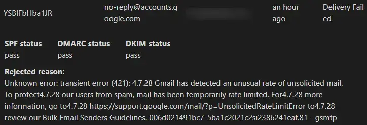

I primarily use Gmail for my email and have multiple email addresses. To use my own domain's email, I set up email routing on Cloudflare to forward all incoming emails to my Gmail account. In Gmail, I added this email as "send as" and used it for outgoing emails as well. It's a neat and free setup. However, recently I noticed that I couldn't accept invitations sent to my domain email. When I press "yes" on the invitation, it turns green, but the meeting doesn't appear on my calendar. This prompted me to investigate and find a solution. Below is how to accept Google Calendar invites sent to a Gmail alias, and whether you can send invites from one.

## How to Accept Calendar Invites Sent to an Alias

First of all, you need to add your domain mail to your Google account as an alternate email. 

It’s pretty easy and you can read about it in Google’s [official documentation](https://support.google.com/accounts/answer/176347?hl=en&pli=1&co=GENIE.Platform%3DDesktop&oco=1). Here’s the process:

1. Open your [Google Account](https://myaccount.google.com/)
2. Select **Personal info**.
3. Under "Contact info," click **Email**.
4. Next to "Alternate emails," select **Add alternate email** or **Add another email**. You may need to sign in again.
5. Enter an email address you own. Select **Add**.

Keep in mind, that it won’t work for Google Workspace, only for personal accounts.

My Cloudflare forwards all emails to my Gmail account and it has led to the problem when I tried to add the alternate email. 

Google rejected its own email as spam lol. So I changed the destination email in Cloudflare to another one and got a verification link from Gmail. I passed the verification and reverted the setting. 

Lastly, you should check a newly appeared setting in Google Calendar, that allow you use your own domain address to accept invitations. That setting will appear in Google Calendar only after 15 minutes you added the alternate email so be patient. 

1. In [Google Calendar](https://calendar.google.com/) on the left, point to the name of your calendar, then click Options Settings and sharing.
2. In the menu on the left under “Settings for my calendars,” click Other notifications.
3. Check the box next to “Allow responding to invitations forwarded through alternative email addresses.”

Aaaand that’s it! Everything works like a charm and you can accept invitations sent to your domain account directly in Gmail.

The only issue with this setup is that if you want to conceal your main Gmail account under a domain email, you can't do that. Google Calendar always sends invites from your main Google account, even if Gmail sends mail as your alias. And when you accept an invite, the inviter will still see your main address.