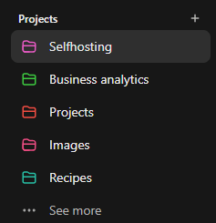

ChatGPT has released "[Projects](https://help.openai.com/en/articles/10169521-using-projects-in-chatgpt)" as part of their [12-day hype](https://openai.com/12-days/) "1 product every day." Finally, they’re starting to fix their clunky UX that feels like it’s been stuck in the Stone Age.

Projects, by the way, have been available in Claude for quite some time, along with a much better UX. For example, Claude pins the chat title at the top, lets you bookmark chats and projects, and even archive them. Hopefully, ChatGPT will add archiving soon too.

Essentially, Projects are advanced folders that separate conversations. You can upload your own files and instructions into each one, and they won’t overlap with others. I've been waiting for this feature forever! My chats are currently a total mess—work discussions, Docker questions, n8n, and blog drafts are all lumped together. What I really want is for ChatGPT to ask me guiding questions about my blog while being a Linux expert who’s devoured all the documentation.

The good news is that you can organize existing chats into Projects. After moving them, you can continue the conversation, and the custom instructions for that project will apply. Though it’s still unclear whether ChatGPT will reanalyze these dialogues from scratch.

Projects are available to everyone — both free and paid users. This is something I’ll definitely use!

