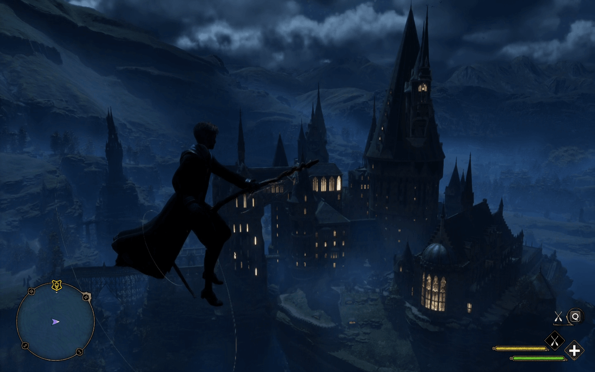
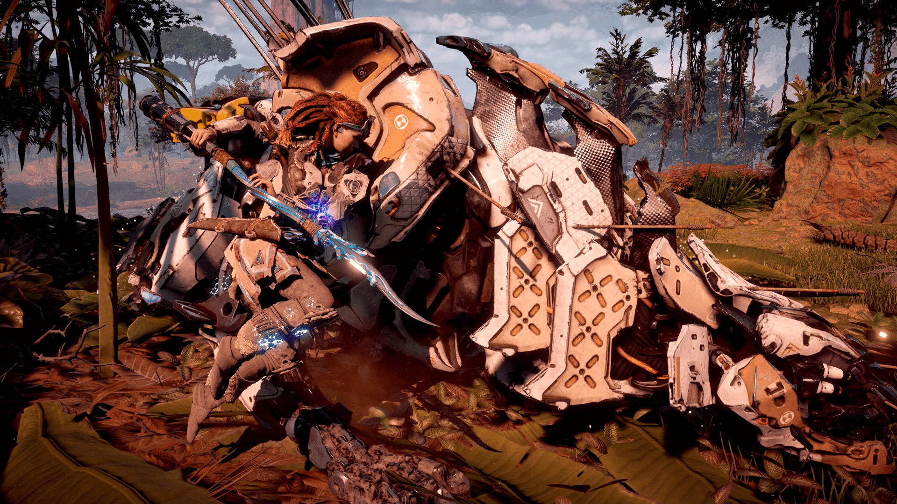
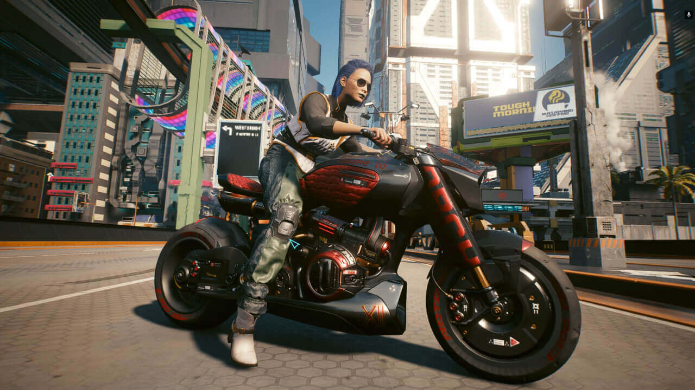
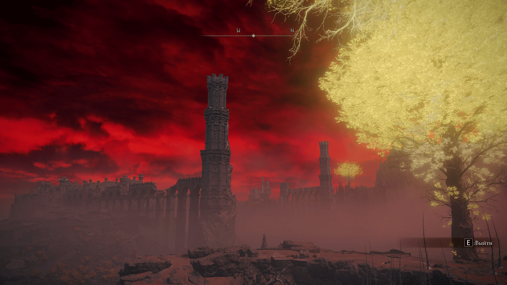

What is cloud gaming and how is it different from regular gaming? Pros, cons and pricing: a critical review of 3 popular Russian services, with comments.

It was the start of COVID. We couldn't go outside, and my girlfriend and I were bored. Death Stranding had just come out, and I really wanted to play it on my laptop. That's how I found out about cloud gaming. Install the client, pay for a plan, and the game starts. The screen turns into a carousel of lag and artifacts. It turned out that playing with my old router was impossible.

A rushed router replacement, another try, and a sudden miracle: the game ran perfectly, and the rich picture was a delight. Then my girlfriend tried playing on her Mac, and that worked well too. That's how we finished Borderlands 2 together, and then 3.

> All in all, I can say that cloud gaming is my choice. I've been using it actively for three years now and I'm quite happy.

# What it is

Cloud gaming is a service that runs a game on a server and sends the picture and sound to your computer. The picture is streamed to your computer, like watching a stream.

System requirements are usually quite low:

- A 2 GHz or faster processor
- 4 GB of RAM or more
- Windows 7 64-bit or newer

So almost any laptop will do. To play, you need to sign up for the service, download the client and pay for a plan.

The main requirement for cloud gaming is a stable internet connection. Picture quality and response time depend on it. For laptops, this means 5 GHz Wi-Fi. It won't work on 2.4 GHz, don't even try. If you can, run a cable from the router, but that's usually inconvenient.

Approximate internet requirements by picture quality:

- 15 Mbit/s for 720p at 60 FPS
- 25 Mbit/s for 1080p at 60 FPS

**Pros of cloud gaming**

- You can play any game on a weak computer. For me, this is the main advantage
- You can play on any platform: Windows, Mac, Linux, phones and even TVs
- Games don't take up space on your computer.

**Cons of cloud gaming**

- You have to pay. Some services have free plans, but that's rare
- Higher response time than on your own PC. Game quality depends on your internet and the distance to the servers
- There may be queues when big games are released.

# Cloud gaming providers

There are 5 cloud gaming providers in Russia right now: [playkey.net](http://playkey.net/), [gfn.ru](http://gfn.ru/), [cloud.vkplay.ru](http://cloud.vkplay.ru/), [loudplay.ru](http://loudplay.ru/) and [drova.io](http://drova.io/). I'll cover the first 3, because they're the only ones I've used.

## Playkey.net

The pioneers of cloud gaming in Russia. They've been around since 2013 and have survived many ups and downs. In 2021 they [were acquired by VK](https://vk.company/ru/investors/info/10904/). There are hourly and unlimited plans. Most Playkey servers [are in Moscow data centers](https://playkey.net/), but there are also some in Saint Petersburg, Novosibirsk and Ukraine.

I use Playkey to play [AAA games](https://en.wikipedia.org/wiki/AAA_(video_game_industry)) that aren't on GFN. I finished Death Stranding, RDR2, Horizon Zero Dawn and Stray on it, all on maximum graphics settings.

**Playkey prices**

Hourly plans

- 1 hour: 80₽
- 100 hours: 6000₽.

Unlimited plans

- 30 days: 1999₽
- 30 days + XBOX Game Pass Ultimate subscription: 2999₽

To make it cheaper, I buy 100 hours at a 40% discount during sales. They usually have sales around New Year and in spring.

**Playkey pros**

- The best game quality of them all. I ran into the fewest lags and freezes here.
- The catalog has all the well-known AAA titles
- Reasonable tech support
- You can play on Windows and Mac OS.

**Playkey cons**

- Plans and price. The highest price among similar services
- Annoying notifications and ads. After you close a game, a browser opens and asks you to rate the game quality. Personally, I find it irritating.

## GFN.ru

The Russian version of Nvidia's cloud service, GeForce Now, created in 2015. The servers are all over the world: GFN.ru works in Russia, Belarus, Moldova, Georgia, Armenia and other countries.

I use GFN for games that take a lot of time: Path of Exile, The Witcher 3, Cyberpunk 2077 and Deep Rock Galactic. The service doesn't have many AAA games, but the good news is that Nvidia has finally [reached a deal with publishers](https://warcraft.blizzplanet.com/blog/comments/microsoft-deal-allows-activision-blizzard-games-back-on-geforce-now), and games from Microsoft and Blizzard will appear on the service.

**GFN prices**

There are no hourly plans. All plans are unlimited, with a 6-hour limit per gaming session. After 6 hours, you have to restart the game.

- 30 days: 1499₽
- 30 days, nights only from 1:00 to 13:00 Moscow time: 599₽

Apparently you can buy access in Turkey or Armenia for $10, but I don't know the details.

**GFN pros**

- There's a free plan, so you can check how it works
- Low prices. The unlimited plan is 500 rubles cheaper than Playkey
- You can play on Windows, Mac OS, Android and even in Google Chrome

**GFN cons**

- Few games. At one point, [Activision](https://www.techspot.com/news/83980-nvidia-forced-remove-activision-blizzard-games-geforce-now.html) and [Microsoft](https://www.theverge.com/2020/4/20/21228792/nvidia-geforce-now-microsoft-xbox-game-studios-warner-bros-remove-games) decided to pull all their games from GFN, so many AAA titles can't be played there
- The client behaves strangely. Sometimes it tells me my network is bad or that I'm using a VPN, even though I'm not.

## Cloud.vkplay.ru

A fairly young cloud gaming service built by VK on top of the VK Play platform. You can see the team actively merging it with Playkey: the website, the texts and the client have become very similar. The servers are in Moscow, Saint Petersburg, Novosibirsk and Yekaterinburg.

The quality was good. I tried it a year ago, and it was worse back then. My latency was pretty low: the ping from Tbilisi was 40 ms. Overall not bad, it feels like Playkey, only more expensive. That first time, everything lagged terribly, but tech support said it was my problem. Meanwhile, Playkey worked fine on the same setup.

**VK Play Cloud prices**

The plans are similar to Playkey's, but more expensive:

Hourly plans

- 1 hour: 80 ₽
- 100 hours: 5199 ₽

Unlimited plans

- 30 days, 60 hours + unlimited nights: 1999₽
- 30 days with no limits: 3599₽

**VK Play Cloud pros**

- You can get 1–8 free hours
- A fairly convenient client. A nice interface both in and out of the game
- You can play on Windows and Mac OS.

**VK Play Cloud cons**

- High prices. 1999 rubles a month for 60 hours of "unlimited" and 3599 for truly unlimited is too much
- Few games. To run a game that isn't in the catalog, you have to install it on the server. For AAA titles at 70–100 GB, that takes a good while.

---

That's all. I'm waiting for Microsoft and Blizzard games to arrive on GFN, and in the meantime I use Playkey.

If you want to support me, subscribe to my [Telegram channel](https://t.me/Press_Any).
