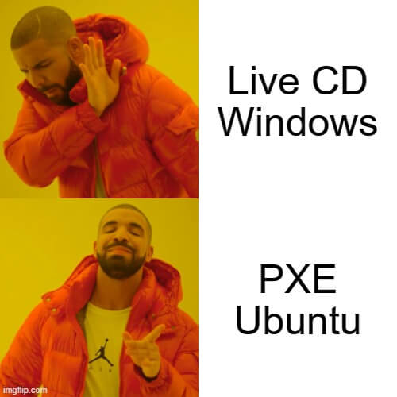
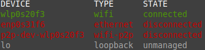
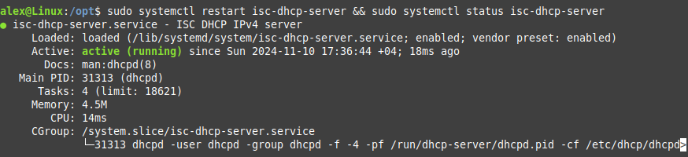
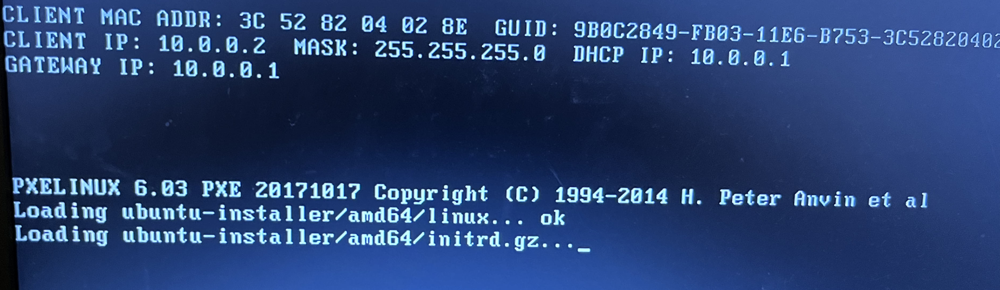
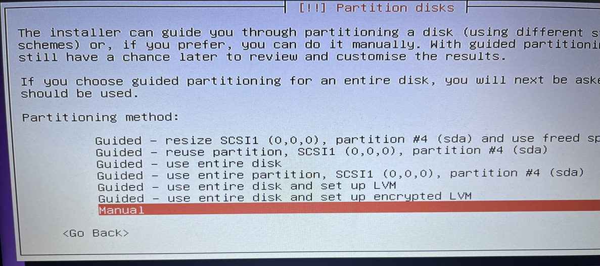
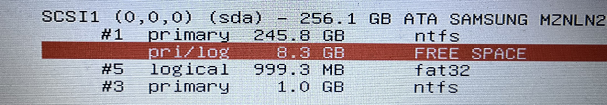
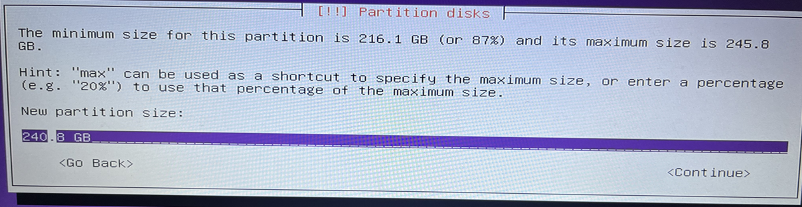

It seems everyone has an old laptop that’s been downgraded to a movie-watching machine. I have one too—connected via HDMI to my TV, pretty much forgotten. One day, just for the heck of it, I installed Linux on it, and a few months later, when I needed space, I decided to simply delete the Linux partition. I rebooted the laptop, and, of course, Windows didn’t load. After installing Linux, GRUB had rewritten the MBR, and now the system didn’t know where to boot from.

What to do? It seemed simple enough: grab a flash drive, boot up with a Live CD, and restore the MBR. But I didn't have a flash drive. Sure, I could borrow one, but I wanted to solve the problem right there and then. As I thought about it, I dug into the BIOS and found out that the laptop supported network booting via PXE…



# The Dilemma

Since I had two operating systems on the disk, I could pick one of two options:

- Boot into a Windows setup and fix the MBR with diskpart
- Install Linux via PXE with a fresh GRUB

The first option seemed tedious and unclear, while setting up a couple of services on Linux felt much more straightforward. So, I went with the second option, using an [Ubuntu server netboot image](http://archive.ubuntu.com/ubuntu/dists/bionic-updates/main/installer-amd64/current/images/netboot/netboot.tar.gz) that’s only 64 MB. I have Linux Mint on my main laptop in dual boot, so I set everything up there.

# Setting Up PXE

The installation generally consists of three steps:

1. Configuring the network interface
2. Setting up TFTP and DHCP servers
3. Booting over the network

## Configuring the Network Interface

To boot via PXE, the computers need to be on the same network. I wasn’t keen on figuring out which network cards support WiFi boot, so I just connected the computers with a cable and created a new interface.

On Linux Mint 21, network setup should be done through Network Manager. Let’s list all the interfaces:

```bash
nmcli device status
```

My Ethernet interface is called `enp0s31f6`.



It needs an IP address. I used the `10.0.0.0` subnet to avoid conflicts with my home network. Replace the IP address and interface name in the command below with your own. This will create a new connection:

```bash
sudo nmcli connection add type ethernet ifname enp0s31f6 con-name NewInterface ipv4.addresses 10.0.0.1/24 ipv4.dns "8.8.8.8" ipv4.method manual connection.autoconnect yes
```

The interface is created and ready to go, and its status can be verified using `ip a` or `nmcli device status`.

## Setting Up the TFTP Server

Next, let’s install the TFTP server to serve the installation files over the network:

```bash
sudo apt install tftpd-hpa apache2 syslinux isc-dhcp-server -y
```

We’ll add the configuration for TFTP to point to the folder with the installation files:

```bash
sudo sed -i 's|TFTP_DIRECTORY=.*|TFTP_DIRECTORY="/opt/tftp"|' /etc/default/tftpd-hpa
```

Let’s create the folder and unpack the system files into the `tftp` directory:

```bash
sudo mkdir /opt/tftp
sudo cp /usr/lib/syslinux/modules/bios/* /opt/tftp/
wget http://archive.ubuntu.com/ubuntu/dists/bionic-updates/main/installer-amd64/current/images/netboot/netboot.tar.gz
sudo tar -xzvf netboot.tar.gz -C /opt/tftp/
```

Next, we’ll configure the PXE boot settings. Open the PXE config file:

```bash
sudo nano /opt/tftp/pxelinux.cfg/default
```

And modify it like so:

```jsx
DEFAULT ubuntu
LABEL ubuntu
MENU LABEL ^Install Ubuntu Server 18
KERNEL ubuntu-installer/amd64/linux
APPEND vga=788 initrd=ubuntu-installer/amd64/initrd.gz
```

Restart the TFTP service to apply the changes:

```bash
sudo systemctl restart tftpd-hpa
```

Our TFTP server is ready.

## Setting Up the DHCP Server

Now, let’s set up the DHCP server. Edit the server’s settings:

```bash
sudo nano /etc/dhcp/dhcpd.conf
```

Specify the IP addresses for your subnet. My configuration for the `10.0.0.0` subnet looks like this:

```bash
subnet 10.0.0.0 netmask 255.255.255.0 {
range 10.0.0.2 10.0.0.100;
option broadcast-address 10.0.0.255;
option routers 10.0.0.1;
next-server 10.0.0.1;
filename "pxelinux.0";
}
```

Save the changes and restart the service. By default, the service doesn’t show output, so I added a status check to the command:

```bash
sudo systemctl restart isc-dhcp-server; sudo systemctl status isc-dhcp-server --no-pager
```

If the service started successfully, the server is up and running.



That’s it for server setup. Now it’s time to boot over the network and install the system.

## Installing the System

Power on the computer and set the network as the primary boot option. The computer gets an IP address, and the installation starts.



Keep clicking through until you get to the partitioning stage. Here, choose “Manual”. Be careful—an incorrect choice could wipe the entire disk.



Currently, Windows is taking up the entire disk. So, we need to shrink this partition and install Ubuntu on the freed space. I allocated 8 GB, though you could probably manage with less:



Open disk #1 and select `resize`. Specify the new size with `GB` and hit Continue. Then select the free space as the install location:



Almost done. Just click through the rest of the installation—no extra packages needed. The installer will rewrite GRUB, and the system will boot properly again.

---

# Conclusion

Everything worked out fine, and the laptop is back in action. The whole PXE setup made me want to automate it… I considered making an Ansible playbook, but I decided against it after finding out about [Fog project](https://fogproject.org/). Fog project is an open-source system that simplifies network installations. I haven't tried it yet, but it seems easy enough, and it includes all the servers you need.

---

## Bonus

I also decided to change the boot order so that Windows boots by default.

By default, the boot order looks like this:

Ubuntu → Advanced option for Ubuntu → Windows

To make Windows boot first, edit the GRUB config:

```bash
sudo nano /etc/default/grub
```

Change `GRUB_DEFAULT=0` to 2.

The GRUB boot order starts at 0, meaning Ubuntu is 0, advanced is 1, and Windows is 2. Apply the changes:

```bash
sudo update-grub
```

Now Windows will be the default OS in GRUB.