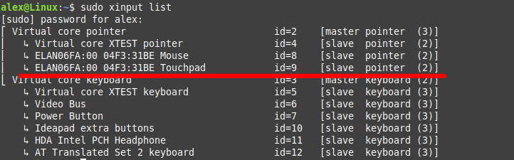

About three months ago, I finally switched to Linux Mint. Overall, everything was fine — but there was one annoying issue with the touchpad. It was way too fast.

There are already [solutions described online](https://askubuntu.com/questions/1120045/touchpad-two-finger-scroll-too-fast#1132826), but none of them worked for me completely. So here’s what I ended up doing.

## Adjusting Touchpad Speed

First, find the ID of your touchpad:

```bash
sudo xinput list
```

You’ll see a list of all input devices — look for the touchpad. In my case, its ID was 9.

Next, check the current scroll speed value. The smaller the number, the faster the touchpad scrolls:

```bash
xinput list-props 'id of touchpad' | grep "Scrolling Distance"
```

You'll see something like that:

```bash
Synaptics Scrolling Distance (351):  -88, 88
```

The result consists of two numbers — in my case, ```-88``` and ```88```. You’ll want to replace them with something larger. I prefer values around 350, but you can go even higher — like 400 or 500.

```bash
xinput set-prop 11 "Synaptics Scrolling Distance" -500 500
```

After that, test how the touchpad behaves. It should feel much better now.
Play around with the numbers and choose the value that feels right to you.

Just don’t forget to save it in a config file — otherwise, the setting will be lost after reboot.

## Config changes

The touchpad config is stored in the folder ```/usr/share/X11/xorg.conf.d```
Find the file responsible for it:

```bash
ls /usr/share/X11/xorg.conf.d/
10-amdgpu.conf  10-quirks.conf  10-radeon.conf  40-libinput.conf  51-synaptics-quirks.conf  70-synaptics.conf  70-wacom.conf
```

Take this file ```70-synaptics.conf``` and copy it to ```/etc```:

```bash
sudo cp 70-synaptics.conf /etc/X11/xorg.conf.d/
```

open and change it:

```bash
sudo vim /etc/X11/xorg.conf.d/70-synaptics.conf
```

Add 2 speed numbers to it as "option" lines:

```bash
    Option "VertScrollDelta"  "-350"
    Option "HorizScrollDelta" "350"
```

You don’t need to touch any of the other settings. In the end, your config should look something like this:

```bash
Section "InputClass"
    Identifier "touchpad custom scroll"
    MatchIsTouchpad "on"
    Driver "synaptics"
    Option "VertScrollDelta"  "-350"
    Option "HorizScrollDelta" "350"
EndSection
```

Save the changes and reboot your system.
After reboot, the device ID might change — so first, check it again, then verify the settings:

```bash
sudo xinput list
```

And then, using the new ID:

```bash
xinput list-props 11 | grep "Scrolling Distance"
```

It should now return the correct values — in my case, it’s ***350***.


That's it — the device ID may change, but the scroll speed will stay just the way you like it.
