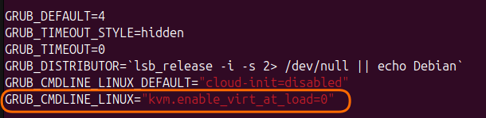

By some silly coincidence, I upgraded my desktop Ubuntu LTS to the latest 25.04 release. And that's when the fun began... Half of my apps stopped working because the desktop environment moved to Wayland with GNOME, and on top of that --- VirtualBox got completely broke. So I started digging.

Turns out that starting from [kernel version 6.12](https://www.virtualbox.org/ticket/22248#comment:1), KVM is enabled
by default in Ubuntu, and it conflicts with VirtualBox. So if you don't need KVM, just disable it.

After trying a few solutions, the one that worked for me was disabling KVM during kernel load via GRUB. Here's how to do it.

Open the GRUB config:

```bash
sudo nano /etc/default/grub
```

In the line `GRUB_CMDLINE_LINUX`, add the parameter `kvm.enable_virt_at_load=0`



Save the changes, then run:

```bash
sudo update-grub
```

And reboot, for example this way:

```bash
sudo reboot
```

That's it. KVM won't load, and it won't interfere with VirtualBox anymore.

And if you want to run VirtualBox through a KVM backend, check out [this repository](https://github.com/cyberus-technology/virtualbox-kvm). I haven't tested it myself, but who knows, maybe you'll find it
useful.
