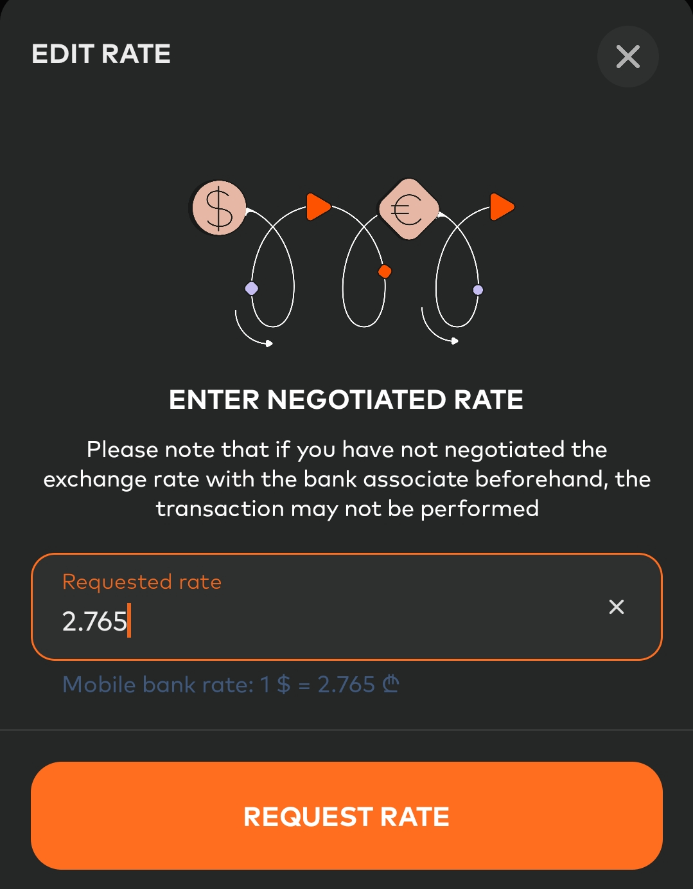

The official USD exchange rate in Georgia right now (25 november 2024) is 2.7384, while at Bank of Georgia it’s 2.6850/2.7850. Their rates have always been terrible, but I recently found out that you can… negotiate the rate! The main condition is an exchange amount starting from 1000 GEL (~$360).

Here’s how it works:

1. Enter an amount of at least 1000 GEL in the app.  
2. A pencil icon appears in the interface.  
3. Tap it, set your desired rate, and submit the request.  
4. The bank will either approve or reject your offer.

I’ve tried this twice, and here are the results:

1️⃣ When the official rate was 2.728 and the bank’s rate was 2.7812, I managed to get 2.755.  
2️⃣ When the official rate was 2.73 and the bank’s rate was 2.7832, they gave me 2.74.  

The difference compared to the initial offer was 0.9–1.6%. It’s not huge, but still a nice perk, especially for large amounts.

