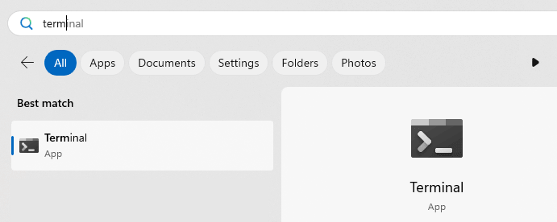
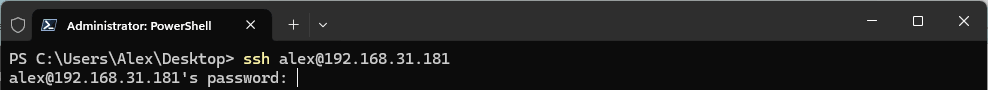
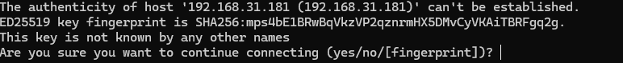
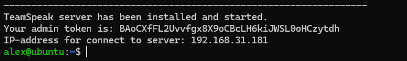
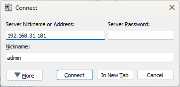
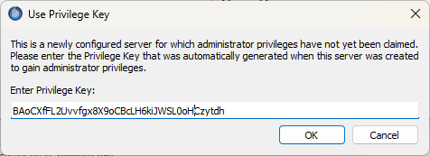
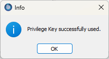
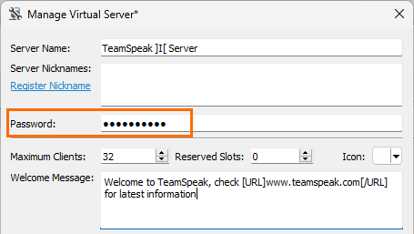
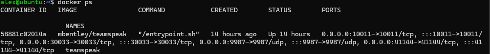
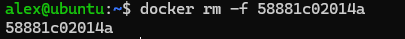

Discord has been blocked in Russia. The legends didn’t lie... I didn’t like it before, and I definitely don’t want to use it through a VPN. So, I decided to set up my own TeamSpeak server and try to bring back the spirit of the 2000s.
Along the way, I created a script that installs a TeamSpeak server in one command. I'm sharing it with you.

# Why TeamSpeak?

Here’s why I like my own TeamSpeak server:

No need to mess with VPNs or other ways to bypass blocks.
Better sound quality and lower ping to the server. TeamSpeak gives us audio at up to 100 Kb/s, while free Discord only offers 64 Kb/s.
With your own server, you can do whatever you want and even set up multiple services.
[A personal bonus for me] [Discord is laggy](https://windowsreport.com/discord-website-defaults-32-bit-app-how-to-download-64-bit/) and always has some sound issues, and only there, nowhere else. In short, I wouldn’t say TeamSpeak is a full replacement for Discord. It only has voice and text chats. You won’t find popular Discord servers or emojis here. But if communicating with friends is your main goal, this is the option for you.

# Setting Up the Server
First, you’ll need to rent a [VPS](https://ru.wikipedia.org/wiki/VPS) (Virtual Private Server). It’s inexpensive — prices start at around 4$ a month. I recommend going for large companies with good reviews.
You can use the server for other tasks like VPN later.

## Installation
We’ll be using [Docker](https://en.wikipedia.org/wiki/Docker_(software)), to avoid cluttering up the system. After purchasing the VPS, you will receive the server’s IP address and login credentials.
Open a terminal (not CMD, but a proper terminal).



Enter the command `ssh username@IP_address_your_server`, for example:

```bash
ssh alex@192.168.31.180
```


Type `yes`, to accept the server’s certificate.



Enter the user password provided when you rented the VPS. Keep in mind that for security reasons, the entered characters won’t be displayed, so it’s easier to copy and paste it.

Run the installation script:

```bash
sudo bash -c "$(curl -L https://raw.githubusercontent.com/Avonae/TS-Docker-Install/refs/heads/main/install_script.sh)"
```
The installation will take 5-10 minutes. Once completed, an admin token will appear on the screen, which we’ll need later.



The server is ready, you can connect now.

## Connecting and Setting Up
Install the [Teamspeak Client](https://teamspeak.com/en/downloads/). I like the old version 3, but you can also use the current version 5.

To connect, enter the VPS IP address in the server address field. Leave the password field empty and set any nickname you like.



On your first connection, you’ll be asked for the admin token. Copy it from the console and press OK:



Done! You are now the server admin.



Everything is set up, but I recommend changing the server password. To do this, right-click on the server and select "Edit Virtual Server," then set a password.



I also suggest maxing out the sound quality. You can do this in the channel settings. Set it to 10 right away to feel the difference from Discord.

That’s it! The server is ready — you can invite your friends. If you have any questions, feel free to ask in the comments.

# FAQ
## Why is your server’s IP local?
In the guide, I used a virtual machine because I already have a working TeamSpeak server, and I don’t want to delete it.

## What exactly does your script do?
You can find the script’s code with comments [in the repository.](https://github.com/Avonae/TS-Docker-Install). 

## What else can you do on the server?
You can add a domain and connect to the server using a nice URL, install [Portainer](https://www.portainer.io/),  and much more...

## How do I delete the server?

First, list the active containers with the command `docker ps`


Then remove the container with the command `docker rm -f container_ID`, in my case:



The container will be stopped and deleted. You can reinstall the server with the same script.