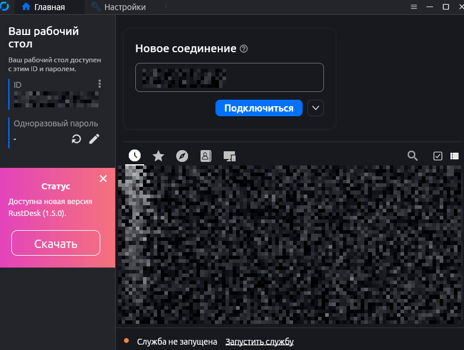

I absolutely love finding open-source alternatives to paid services. Today, I want to share a free, open-source alternative to TeamViewer and AnyDesk that I personally use for remote support for my grandmothers.

Like many others, I started with TeamViewer. Then it left Russia, and I switched to AnyDesk. Yesterday, AnyDesk decided not to work for me, so I installed [RustDesk](https://rustdesk.com/). And I'm telling you, it is god-tier remote support software.

Why? Because RustDesk turned out to be a lifesaver. Everything works right out of the box: connect, send files, do what you want. It feels like the perfect remote connection tool.

A few highlights about RustDesk:

- It works *flawlessly*: fast, no lags, no glitches.
- It’s free, ad-free, and comes with [open-source code](https://github.com/rustdesk/rustdesk).
- You can set up your own [server](https://rustdesk.com/docs/en/self-host/rustdesk-server-oss/docker/) for connections. Maybe I’ll get around to that someday...

## How to Connect with RustDesk

1. Install RustDesk on both computers. It runs on Windows, macOS, Linux and Android; the iOS app can only control other devices.
2. On the remote computer, open RustDesk and read out the ID and one-time password from the main screen.
3. On your computer, enter that ID, click Connect and type the password.

For a computer you'll connect to regularly, set a permanent password in Settings → Security (click "Unlock security settings" first), so nobody has to read you the code every time.

The only setting I changed was the scaling: I changed it from “Scale original” to “Scale adaptive” to work comfortably in windowed mode.

For my grandmothers, I set up connections with permanent passwords. Remote support has never been this easy.
