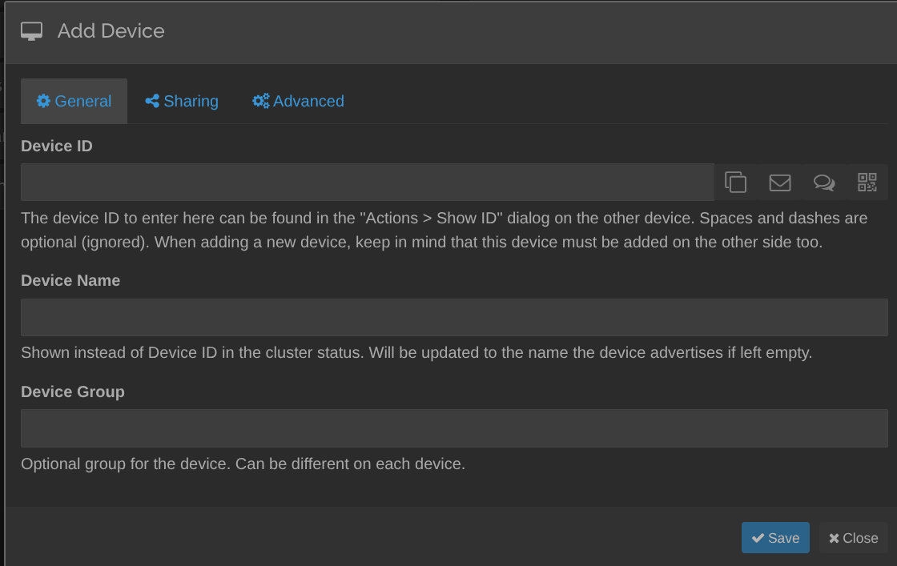

About a year ago, I got obsessed with the idea of data centralization and decided to start with my notes. I chose Obsidian because it stores everything locally and is highly customizable with plugins. In this post: how I set up Obsidian sync with Syncthing between my phone and computer, and why I moved away from GitHub.

So, my notes were synced through GitHub: after saving, the changes were pushed to GitHub and then pulled to other devices when I opened the app.

But this setup had a few downsides:

- Constant merge conflicts  
- Plugins didn’t sync (though this can be solved separately)

Anyone who's worked with Git knows how often sync conflicts pop up — and how annoying they are. So I decided to look for something simpler and ended up with [Syncthing](https://github.com/syncthing/syncthing).

Syncthing is an open-source synchronization tool. You install it on a device, specify which folder to sync, and then connect another device for synchronization. The system takes the selected folder, encrypts it, and sends it either directly to the device or through a relay server. Technically, you don't even need a server — as long as both devices are online, they’ll find each other and sync. But I still set it up on a server to have a single entry point.

Syncthing comes with a web interface, so the first thing you’ll want to do is hide it behind a VPN or secure it somehow. I used a [Cloudflare Zero Trust tunnel](https://developers.cloudflare.com/cloudflare-one/connections/connect-networks/#how-it-works) to protect it. After that, you just install Syncthing on your other devices and connect the folders you want to sync.

## How to Sync Obsidian with Syncthing

1. Install Syncthing on your computer and phone. On Android, use Syncthing-Fork (the official app is no longer developed); for iPhone, there's the third-party Möbius Sync.
2. On the computer, add your Obsidian vault folder as a Syncthing folder.
3. Connect the devices: in the web UI, click "Add Remote Device" and paste the other device's ID. You'll find it in that device's web UI under Actions → Show ID, or in the app menu on a phone.
4. Share the vault folder with that device and accept the request on the phone.
5. On the phone, open the synced folder in Obsidian as a vault.



The `.obsidian` folder syncs along with the notes, so plugins and settings come over too. To keep devices from overwriting each other's open tabs, I added this to `.stignore`:

```
.stversions
.git
workspace.json
```

Also turn on file versioning in the folder settings — then an accidentally deleted note stays in `.stversions`. I use Staggered File Versioning with a maximum age of 365 days.


As a bonus, I wanted some kind of backup (as if syncing across three devices wasn’t enough), so I made an automated GitHub push. With ChatGPT, [we created a script](https://github.com/Avonae/Scripts/tree/main/push-to-github) that pushes changes to GitHub once an hour. For fun, I also set up [GPG commit signing](https://docs.github.com/en/authentication/managing-commit-signature-verification/generating-a-new-gpg-key#generating-a-gpg-key), so now my commits have that nice little Verified badge xD.

In the end, I’ve got the same notes on my phone and computer, no merge conflicts, hourly GitHub backup — and it all took maybe 4 hours to set up.  
The sync speed is shockingly fast — changes show up on my phone in under 20 seconds. Highly recommended.


