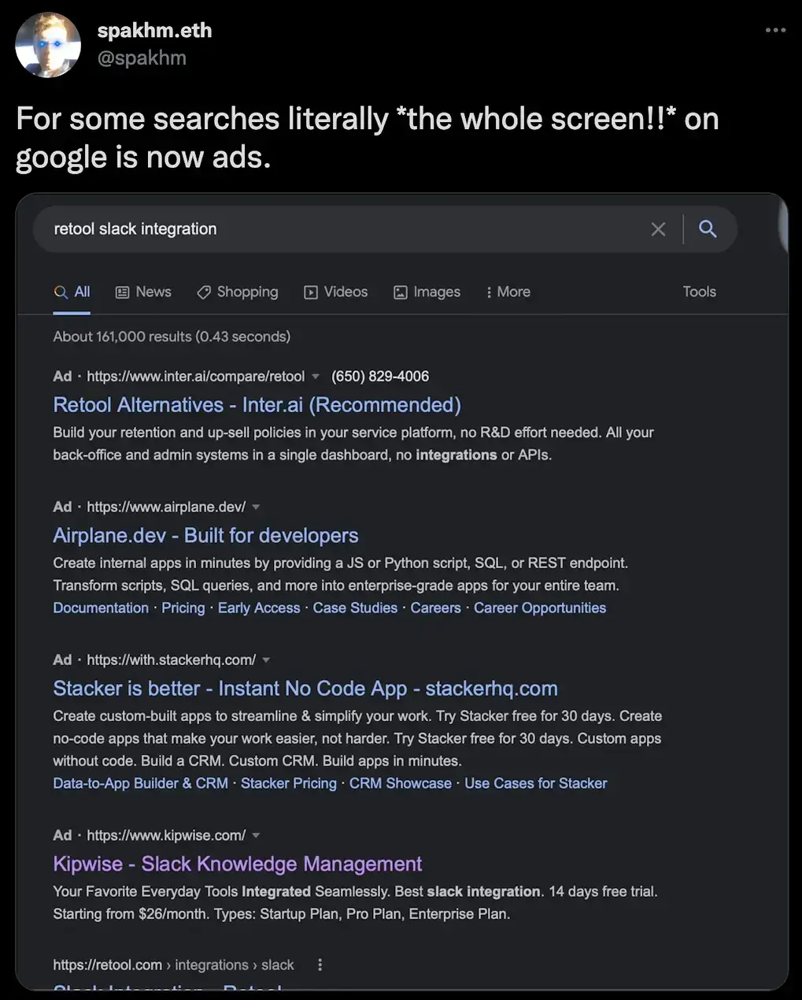

I've been using Google all my life and it searched okay until recently. Around the last 2 years, I started to notice that search results are becoming way worse than before. Here's what happened: I broke something on my grandmother's computer and tried to figure out the problem. I asked Google, and the results were full of SEO-generated websites, all of which recommended running "Windows troubleshooting." The craziest part was that among the top results was a video showing the same thing! It pissed me off.

This problem isn't just about fixing Windows issues; the search results are full of irrelevant shit that wastes your time instead of solving the problem. To get over it, people add the word "reddit" to search queries, assuming that Reddit content is mainly created by real people. I said “mainly”, because [there's already a service](https://www.404media.co/ai-is-poisoning-reddit-to-promote-products-and-game-google-with-parasite-seo/) that uses AI to write comments on Reddit and thus promote your service. According to Google's logic, Reddit itself is a trusted site with a high citation index, which means that everything posted on it is considered okay by default. I think such SEO methods bad, but they seem to be genuinely effective.

The idea that Google search has gotten worse is not entirely new. It's been discussed in tech circles for [over 2 years now](https://dkb.blog/p/google-search-is-dying), and alternative searches like Kagi continue to show up. Thanks to the process against Google, we found out that they [intentionally spoiled the search](https://www.justice.gov/atr/case/us-and-plaintiff-states-v-google-llc), forcing users who couldn't find the information they needed to keep searching. I recommend reading an article on this topic — [The Man Who Killed Google Search](https://www.wheresyoured.at/the-men-who-killed-google/), where the author talks about how bad managers’ decisions to improve short-term metrics affect users in the long run.

As for me, I'm not ready to pay for a good search yet, and I don't like DuckDuckGo as well. I also heard that adding “before:2020” will improve search results. I recommend you try it.

So, I'll be trying services like perplexity.ai and [thebrowser.company](http://thebrowser.company) in hopes of finding something suitable. What do you think? Did you notice the difference or just don’t care about it?

