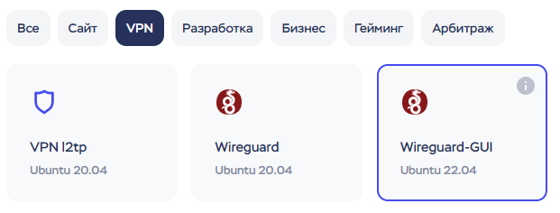
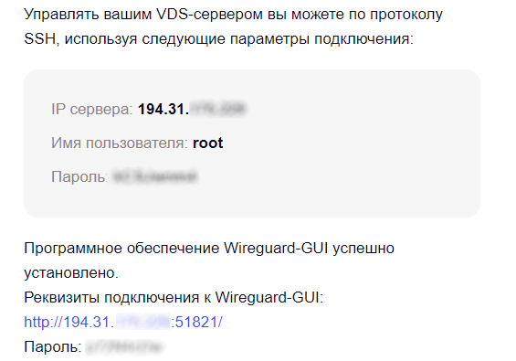
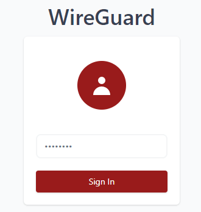
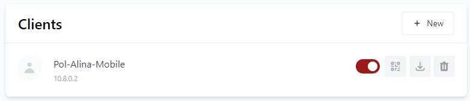
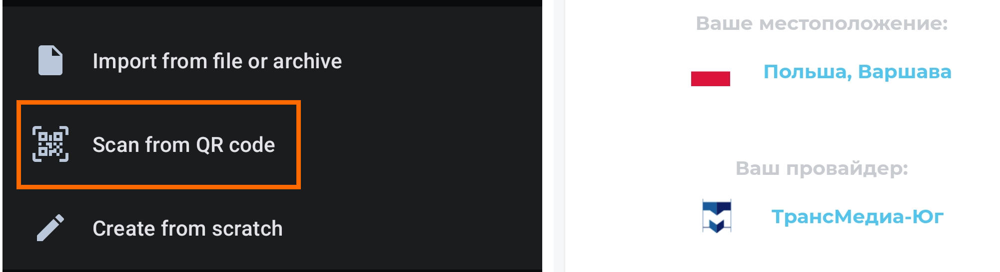
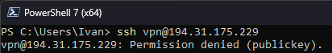

This post is about running a VPN on your own server. Today we'll install Wireguard VPN with a handy web interface that lets you create configs for friends right in the browser. I use this setup myself, and so do 20 of my friends.

The main problem with a VPN is finding a decent VPS provider that accepts a Russian card. Pick whichever you like. I liked TimeWeb, where everything is ready out of the box. I did see people complain about it in the comments, though, so Firstbyte is an alternative. It costs 300 rubles and registration is a bit more of a pain, but you can enter a throwaway email and a random phone number from an identity generator.

## Why bother?
There's no such thing as a free lunch. If you use a free VPN, ask yourself how it makes money. Free VPN services [sell your data](https://privacysavvy.com/vpn/guides/free-vpns-sell-information/) to advertisers. You know nothing about what happens to your traffic and have no control over it. On top of that, the government is trying to block popular VPN services.

Your own VPN server gives you not only a stable connection but also a lower chance of being blocked. I say a lower chance, not guaranteed protection, because the government keeps inventing new ways to fight circumvention. Wireguard is a fairly popular protocol and it's easy to detect. We'll look at how to protect your server from blocking in future posts.

The whole setup takes 2 steps: renting a server and creating clients for yourself and your friends.

# Renting a server

Let's rent a server. Pick any provider you like. If you have a foreign card, I can recommend mvps.net. They have a [ready-made VPN solution](https://www.mvps.net/vps-app/wireguard), though traffic is capped at 2 TB. I haven't managed to use that much yet.
Renting a server from TimeWeb:
1. Go to the website and sign up.
2. In the left menu, choose **Cloud servers > Create > Marketplaces > VPN > Wireguard-GUI**.

3. Choose a region.
4. Turn off backups under **Additional services**.
5. Pay. I paid for a month, **it came to 188 rubles**. By default, the card is saved for future payments. You can remove it in the Finance section.
6. Wait for an email with the VPN connection details.

# Creating clients
The server is set up. Now connect the clients: phones and computers. You can have as many as you want, traffic is unlimited. [Install Wireguard](https://www.wireguard.com/install/) on your devices.
1. Follow the link in the email.

2. Log in with the password from the same email.

3. Click **New Client** and enter any name. I use a **Country-Name-Device** scheme so I don't mix people up. As an example, let's create a phone config for my friend Alina: **Pol-Alina-Mobile**.

4. Each config has a download button and a QR code. Click the QR code button and it appears on screen.
5. Open Wireguard on your phone and tap the plus button.
6. Scan the QR code from the web interface and voilà, you're done. Our VPN works. You can check it on any service like 2ip:

Create configs for all your devices the same way.

# Conclusion
This section is for advanced users. It has optional settings and some of my thoughts.

## Security
A server with a public IP address and password authentication is considered insecure. But the password the hosting provider generates is good enough. See for yourself: cracking the password **zYq6FV3j** would take [a thousand years](https://www.passwordmonster.com/). So you can forget about it if you don't want to bother.

Ideally, though, turn off password authentication and keep only key authentication. A key is basically just a long password stored on your computer. To set up key authentication:
1. Open PowerShell and run `ssh-keygen`. Press Enter 3 times.
2. The system saves the key file in `C:\Users\Your_User_Name\.ssh/`. Open this folder and find the file `id_rsa.pub`.
3. Open the file in a text editor and copy its contents.
4. Go back to the hosting provider's website and select your server under Cloud servers.
5. Open the **Access** section.
6. In the SSH keys field, click **Edit** and paste the copied key.
7. The key is added. Go back one step and activate the new key. TimeWeb has detailed instructions about keys on its website.
8. Done, now you can log in to the server without a password. All that's left is to turn off password authentication. As an example, I'll use the server address `111.111.111.11`.
9. Connect to the server over SSH: `ssh root@111.111.111.111`
10. Open the SSH config file: `nano /etc/ssh/sshd_config`
11. Find the line `PasswordAuthentication Yes` and change `Yes` to `No`. Save the changes with Ctrl+X. TimeWeb servers have an extra file with this directive, so turn it off there too: `mv /etc/ssh/sshd_config.d/50-cloud-init.conf ~`
12. Restart the SSH service: `systemctl restart ssh`
13. Done, the server is secure now and password login won't work. The server is set up and ready.

## Updates
Automatic system updates (unattended upgrades) are on by default. You can check them with `systemctl status unattended-upgrades --no-pager -l`

You could also create a user so you don't work as root..:)

If you have questions, ask in the comments, I'm happy to help. Subscribe to my [Telegram channel](https://t.me/Press_Any), where I write useful posts and tell stories from the IT world.
