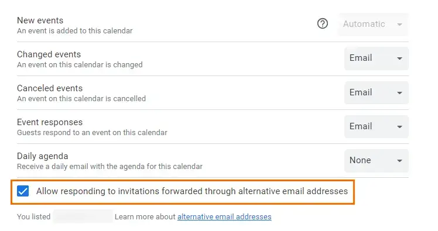

Почтой я пользуюсь в основном гугловой и адресов у меня несколько. Чтобы пользоваться почтой на своём домене, я настроил в Cloudflare маршрутизацию: все входящие письма пересылаются в мой аккаунт на гмейле. Там я добавил этот адрес как «Отправлять письма как» и отправляю с него исходящие. Удобно и бесплатно. Но недавно я заметил, что не могу принять приглашение в календарь, отправленное на доменный адрес. Нажимаю «Да» — кнопка зеленеет, а встреча в календаре не появляется. Пришлось разбираться.

# Что нужно

Сначала добавьте доменный адрес в аккаунт Google как дополнительный.

Это несложно, всё описано в [официальной документации](https://support.google.com/accounts/answer/176347?hl=ru) Google. Порядок такой:

1. Откройте [аккаунт Google](https://myaccount.google.com/).
2. Выберите **Личная информация**.
3. В разделе «Контактная информация» нажмите **Электронная почта**.
4. Рядом с «Дополнительные адреса электронной почты» выберите **Добавить дополнительный адрес** или **Добавить ещё один адрес**. Возможно, придётся войти в аккаунт ещё раз.
5. Введите свой адрес и нажмите **Добавить**.

Учтите: так работает только для личных аккаунтов, в Google Workspace не получится.

Мой Cloudflare пересылает все письма в Gmail, и на этом я споткнулся, когда добавлял дополнительный адрес.

Google отправил в спам собственное письмо, лол. Поэтому я временно поменял в Cloudflare адрес пересылки на другой, получил ссылку для подтверждения от Gmail, подтвердил адрес и вернул настройку обратно.

Осталось включить в Google Календаре новую настройку, которая разрешает принимать приглашения на доменный адрес. Она появляется только минут через 15 после добавления дополнительного адреса, так что наберитесь терпения.

1. В [Google Календаре](https://calendar.google.com/) слева наведите курсор на название календаря, нажмите «Параметры» → «Настройки и общий доступ».
2. В меню слева в разделе «Настройки моих календарей» выберите «Другие уведомления».
3. Поставьте галочку «Разрешить отвечать на приглашения, пересланные через дополнительные адреса электронной почты».

Вооот и всё! Всё работает как часы, и приглашения на доменный адрес можно принимать прямо в Gmail.

Единственный минус: спрятать основной адрес Gmail за доменным не выйдет. Пригласивший всё равно его увидит.
