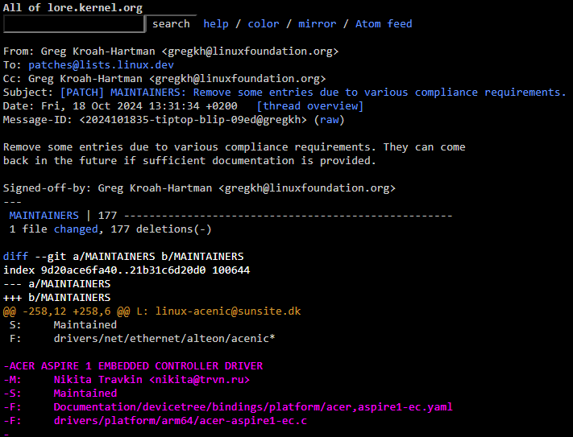

11 русских разработчиков были забанены Linux Foundation.

22 октября Greg Kroah-Hartman, второй человек после в Linux Foundation, удалил 11 русских разработчиков из списка мейнтейнеров ядра. В основном, это разработчики различных драйверов.

В комментарии Грег указал, что удаление связано с санкциями и в будущем разработчики могут вернуться, если предоставят «подтверждающие документы».  Что это всё означает, никто не понял.

После попыток разобраться, Линус Торвальдс, создатель линукса через 2 дня написал:

> Совершенно ясно, почему это было сделано, и решение не будет изменено. <...> Если вы еще не слышали о российских санкциях, попробуйте как-нибудь почитать новости. И под «новостями» имею в виду не спонсируемые российским правительством издания.
> 
> Что касается отправки мне отменяющего изменения патча — пожалуйста, используйте ту кашицу, которую вы называете мозгами. Я финн. Неужели вы думали, что я буду поддерживать российскую агрессию? Видимо, дело не только в чтении новостей, но и в незнании истории. <...>

А когда пользователи указали ему на невнятное объяснение и просьбы  нормально объяснить в чём дело, он написал:

> Нет, я не собираюсь вдаваться в подробности, которые мне и другим мейнтейнерам разъяснили юристы. Я также не собираюсь обсуждать юридические вопросы со случайными людьми в интернете, которые, как я подозреваю, являются ботами <...>

Как по мне, это полное дерьмо. Вот тебе и опенсорс. Мы конечно всё понимаем, санкции США и всё такое, но можно же было высрать какое-то вменяемое объяснение? Люди на добровольных началах вкладывались в продукт, чтобы потом их просто забанили из-за того что они русские. С кайфом. Короче, горит нереально.

Почитать комментарии к [новости на ycombinator.](https://news.ycombinator.com/item?id=41927838)
Ссылка на сам [патч с удалением](https://lore.kernel.org/all/2024101835-tiptop-blip-09ed@gregkh/)

