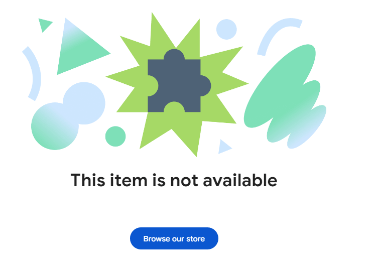
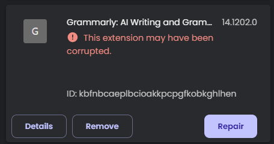

Сегодня я проснулся и обнаружил, что добрая треть моих расширений в Brave перестали работать. В хроме ситуация точно такая же. Что делать?

# Что случилось

Гугл внедрил новую версию АПИ, т.н. "Manifest V3", которая сильно ограничиает, а подчас и вовсе делает невозможным работу блокировщиков рекламы. Очень сильно из-за этого пострадал популярный блокировщик ublock Origin, в котором используются списки плохих сайтов, обновляемых пользователями. Эти списки обновлялись автоматически, а 3-я версия манифеста не позволяет этого сделать. Я пользуюсь браузером Brave, и [ublock Origin](https://ru.wikipedia.org/wiki/UBlock_Origin) пока работает, но непонятно надолго ли это.

Почитать подробнее [можно здесь](https://3dnews.ru/1112538/google-chrome-nachal-otklyuchenie-ublock-origin-izza-perehoda-na-manifest-v3).

Чтобы починить сломанные расширения, просто зайдите в раздел "Extensions" и последовательно нажмите кнопку "Repair" на каждом из них. Расширения при этом будут переустановлены.

Однако этот способ не помог мне с расширение Grammarly. Оказалось, что оно было просто удалено из магазина расширений. Никаких новостей на эту тему я не нашёл. Ждём обновлений по ситуации...

Ссылка на расширение: [https://chromewebstore.google.com/detail/grammarly-grammar-checker/](https://chromewebstore.google.com/detail/grammarly-grammar-checker/kbfnbcaeplbcioakkpcpgfkobkghlhen)