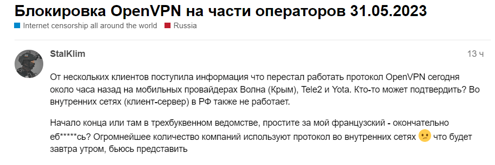

Сегодня, 31.05.23 в России у некоторых пользователей OpenVPN начало отваливаться соединение. К примеру, перестал работать бесплатный сервис антизапрет, работающий по этому протоколу. Проблема наблюдалась у провайдеров МТС, Ростелеком, Теле2, Yota.

Первые заявления о блокировках появились 30 мая в районе 8 вечера. Пользователи пишут, что блокировка разрывает сессию OpenVPN после нескольких пакетов. Думаю, что DPI анализирует пакеты, узнаёт OpenVPN и разрывает соединение.

Техподдержка Yota сказала что на их стороне ничего не блокируется, и если мы им верим — можно предполагать блокировки на уровне магистральных провайдеров.

Кажется, что это было тестовое включение, т.к. к текущему моменту блокировку убрали. OpenVPN используется большим количеством компаний для организации доступа ко внутренней сети. Интересно посмотреть, как блокировки на них повлияют.

Пока что выглядит так, что просто VPN протоколы, вроде OpenVPN и Wireguard, работать не будут. Надо использовать маскировку трафика и хитрые способы обхода блокировок. О них я напишу чуть позже)

Подписывайтесь на [мой телеграм-канал,](https://t.me/Press_Any) в нем я рассказываю про обходы блокировок.