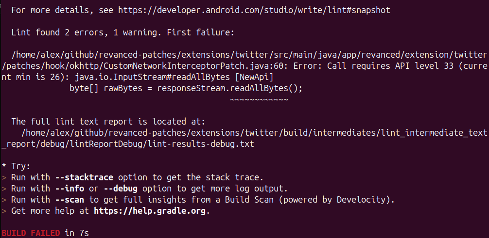

Я использую [Revanced Manager](https://revanced.app/download) - приложение, позволяющее пропатчить APK файл на андроиде и применить к нему всякие улучшения. Рут для него не требуется. 
Что умеют патченные приложения:
- Отключать рекламу
- Настраивать ленту, например, отключить стримы в тиктоке
- Добавлять функции вроде sponsorblock на ютубе

Я использую много пропатченных приложений: инстаграм, ютуб, реддит и тикток. И недавно решил обновить версию инстаграма себе. 

Оказалось,что в актуальном релизе ReVanced патч на рекламу для инсты не работает. К счастью, исправление нашлось в dev-ветке. Поэтому патчи придётся собрать из dev самому... 
Пришлось повозится, потратить минут 30, но зато инстаграм без рекламы.

Процесс состоит из двух этапов:

1. Собрать файл патчей `.rvp` из исходников на компьютере.
2. Пропатчить APK этим файлом через ReVanced CLI в Termux на телефоне.

## Подготовка
Вам понадобится:

- Аккаунт на [гитхабе](https://github.com/).
- Приложение [терминала Termux](https://f-droid.org/en/packages/com.termux/), установленное через F-Droid.
- APK приложения, которое хотите пропатчить. Для инстаграма нужна версия 425.0.0.47.61, [скачать ее можно с APK Mirror](https://www.apkmirror.com/apk/instagram/instagram-instagram/instagram-425-0-0-47-61-release/instagram-425-0-0-47-61-20-android-apk-download/) 

## Этап 1. Сборка патчей ReVanced из исходников

### Установка зависимостей

Нам нужны JDK 17 и git.



```bash
sudo apt install openjdk-17-jdk git
```


```bash
brew install openjdk@17 git
```


Установите [JDK 17](https://adoptium.net/temurin/releases/?version=17) и [Git for Windows](https://git-scm.com/download/win).



### Токен GitHub

Зависимости проекта лежат в GitHub Packages, поэтому надо сделать токен для чтения `packages`.

Создайте **classic**-токен на https://github.com/settings/tokens/new со scope `read:packages`. Затем запишите его в `gradle.properties` в домашней папке:

```
githubPackagesUsername=ваш_логин_на_github
githubPackagesPassword=ghp_...
```



Путь к файлу: `~/.gradle/gradle.properties`. Закройте его от других пользователей:

```bash
chmod 600 ~/.gradle/gradle.properties
```


Путь к файлу: `~/.gradle/gradle.properties`. Закройте его от других пользователей:

```bash
chmod 600 ~/.gradle/gradle.properties
```


Путь к файлу: `C:\Users\<имя>\.gradle\gradle.properties`.



### Клонирование dev-ветки

Клонируем ветку `dev` с гитлаба:

```bash
git clone -b dev https://gitlab.com/ReVanced/revanced-patches.git
cd revanced-patches
```

### Android SDK

1. Скачайте Android SDK со [страницы Android Studio](https://developer.android.com/studio#command-line-tools-only), раздел «Command line tools only».
2. Положите папку `licenses` в `~/Android/dependency/`. Внутри должен быть файл `licenses/android-sdk-license`.
3. Создайте в корне репозитория файл `local.properties` и укажите в нём путь к папке с SDK. Замените `user` на имя своего пользователя.



```
sdk.dir=/home/user/Android/dependency
```


```
sdk.dir=/Users/user/Android/dependency
```


```
sdk.dir=C\:\\Users\\user\\Documents\\dependency
```

Двоеточие и обратные слеши нужно экранировать обратным слешем, иначе Gradle прочитает путь неправильно.



### Правка minSdk для Twitter

В дев сборке сейчас (на 07.10.26) есть небольшая ошибка и сборка падает при компиляции, поэтому надо поправить 1 файл:

```
CustomNetworkInterceptorPatch.java:60: Error: Call requires API level 33 (current min is 26): java.io.InputStream#readAllBytes [NewApi]
              byte[] rawBytes = responseStream.readAllBytes();
```



Чтобы её исправить, в файле `extensions/twitter/build.gradle.kts` замените `minSdk = 26` на `minSdk = 33`.

### Сборка

Находясь в папке `revanced-patches`, запустите:



```bash
./gradlew build
```


```bash
./gradlew build
```


```
.\gradlew.bat build
```



Готовый файл появится здесь: `patches/build/libs/patches-<версия>.rvp`. Файл с суффиксом `-sources.rvp` нам не нужен.

## Этап 2. Патчинг APK через ReVanced CLI в Termux

Теперь из патчей собираем само приложение. Делать это будем прямо на телефоне.

### Подготовка

1. Установите [Termux из F-Droid](https://f-droid.org/en/packages/com.termux/). Версия из Google Play не подойдёт.
2. В файловом менеджере создайте папку `revanced` внутри `Download`.
3. Положите в неё три файла:
   - `.jar` из [ReVanced CLI](https://github.com/revanced/revanced-cli/);
   - файл патчей `.rvp`, собранный на первом этапе;
   - APK приложения. Я патчил Instagram версии 425.0.0.47.61, его можно [скачать с APKMirror](https://www.apkmirror.com/apk/instagram/instagram-instagram/instagram-425-0-0-47-61-release/instagram-425-0-0-47-61-20-android-apk-download/).

В итоге в папке `/storage/emulated/0/Download/revanced/` должно получиться 3 файла.

### Настройка Termux

1. Дайте Termux доступ к файлам и согласитесь с запросом прав:

   ```bash
   termux-setup-storage
   ```

2. Сохраните путь к папке в переменную:

   ```bash
   revanced=/storage/emulated/0/Download/revanced
   ```

3. Выберите зеркало репозитория пакетов:

   ```bash
   termux-change-repo
   ```

4. Установите wget и JDK:

   ```bash
   pkg install wget openjdk-17 -y
   ```

### Загрузка aapt2

ReVanced CLI нужен `aapt2`, собранный под архитектуру процессора телефона. Узнайте её командой в Termux:

```bash
getprop ro.product.cpu.abi
```

Команда выведет `arm64-v8a` или `armeabi-v7a`. Большинство современных телефонов — `arm64-v8a`.

Скачайте библиотеку для своей архитектуры:



```bash
wget https://github.com/ReVanced/revanced-manager/raw/refs/heads/main/app/src/main/jniLibs/arm64-v8a/libaapt2.so && chmod +x libaapt2.so
```


```bash
wget https://raw.githubusercontent.com/ReVanced/revanced-manager/refs/heads/main/app/src/main/jniLibs/armeabi-v7a/libaapt2.so && chmod +x libaapt2.so
```



### Патчинг

```bash
java -jar $revanced/*.jar patch -bp $revanced/*.rvp --custom-aapt2-binary ./libaapt2.so $revanced/*.apk
```

Команда создаст файл с суффиксом `-patched`. Переносим его в папку `revanced`:

```bash
mv *-patched.apk $revanced
```

### Установка

Пропатченное приложение подписано другим ключом, поэтому поверх оригинала оно обычно не ставится. Удалите установленное приложение и поставьте собранное приложение `-patched.apk` с нуля.

Готово. Теперь у вас инста без рекламы, вы великолепны.
