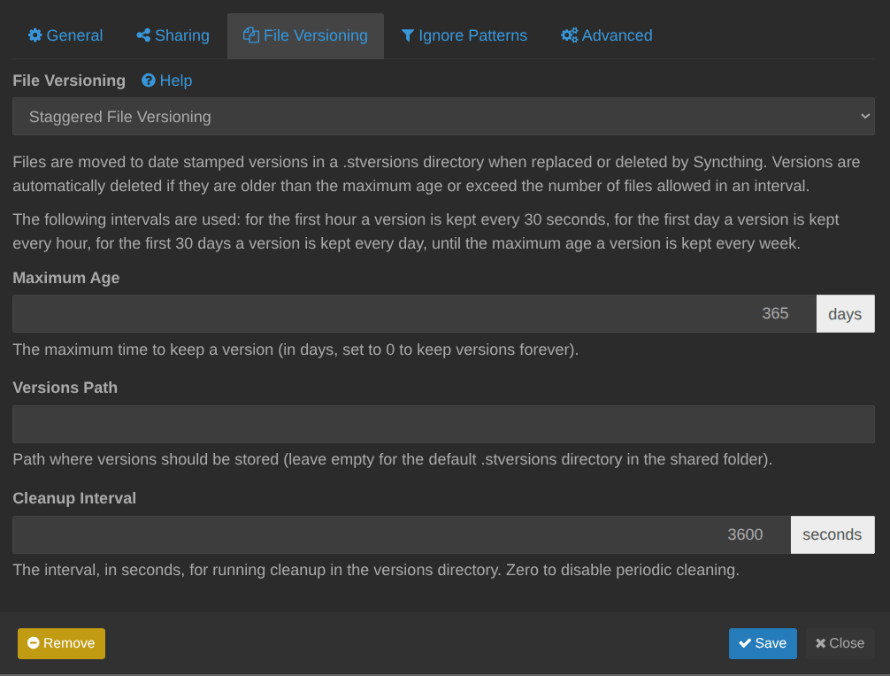

Где-то год назад я увлёкся идеей централизации данных и решил начать с заметок. Я выбрал для себя Obsidian, потому что заметки хранятся локально и легко кастомизируется с помощью плагинов. В этом посте — как я настроил синхронизацию Obsidian через Syncthing между телефоном и компьютером и почему ушёл с GitHub.

Ну и вот. Мои заметки синкались через GitHub: после сохранения, правки отправлялись на гитхаб и потом скачивались на других устройствах после захода в приложение.

Но у такой схемы есть несколько минусов:

- Вечные какие-то мердж конфликты
- Плагины не синхронизируются, хотя это в общем-то решаемо

Кто с гитом работал, знает что конфликты синхронизации возникают сплошь и рядом и порядком заёбывают. Поэтому я решил найти что-то попроще и так пришел к [syncthing](https://github.com/syncthing/syncthing).

Syncthing — это опенсорсная утилита для синхронизации. Ставишь ее на устройство, указываешь какую папку синкать, а потом подключаешь устройство для синхронизации. Система берет выбранную папку, шифрует ее и отправляет на устройство напрямую или через relay-сервер. Строго говоря, сервер даже не нужен - данные будут проверяться, когда устройства оба будут в сети. Но я поставил на сервер, чтобы была единая точка входа.


Syncthing идет в комплекте с веб-интерфейсом, так что на сервере его первым делом надо спрятать под  VPN или как-то еще защитить. Я спрятал за [Cloudflare Zero Trust туннелем](https://developers.cloudflare.com/cloudflare-one/connections/connect-networks/#how-it-works). Дальше остаётся поставить Syncthing на остальные устройства и подключить нужные папки. 

## Как настроить синхронизацию Obsidian через Syncthing

1. Установите Syncthing на компьютер и на телефон. На Android — Syncthing-Fork (официальное приложение больше не развивают), для iPhone — сторонний Möbius Sync.
2. На компьютере добавьте папку с хранилищем Obsidian (vault) как папку Syncthing.
3. Свяжите устройства: в веб-интерфейсе нажмите «Добавить удалённое устройство» и вставьте ID второго устройства. Его можно посмотреть в веб-интерфейсе того устройства: «Действия → Показать ID», на телефоне — в меню приложения.
4. Поделитесь папкой vault с этим устройством и примите запрос на телефоне.
5. На телефоне откройте синхронизированную папку в Obsidian как хранилище.


Папка `.obsidian` синхронизируется вместе с заметками, так что плагины и настройки тоже приедут. Чтобы устройства не перетирали друг другу открытые вкладки, я добавил в `.stignore`:

```
.stversions
.git
workspace.json
```

И включите версионирование файлов в настройках папки — тогда случайно удалённая заметка останется в `.stversions`. У меня стоит ступенчатое версионирование (Staggered File Versioning) с хранением версий 365 дней.



Ну и в дополнение, хотелось сделать какой-то бэкап (будто бы на 3-х устройствах мало), я решил сделать некий автоматический пуш на гитхаб. С Chatgpt [мы сделали скрипт](https://github.com/Avonae/Scripts/tree/main/push-to-github), который отправляет изменения в гитхаб раз в час. Ну и поприколу я настроил [подпись коммитов с помощью GPG ключа](https://docs.github.com/en/authentication/managing-commit-signature-verification/generating-a-new-gpg-key#generating-a-gpg-key), так что у них теперь есть красивая плашка Verified, гы.

В результате, у меня актуальные заметки на телефоне и компьютере без всяких конфликтов, бэкап на гитхаб и всё это за каких-то часа 4 возни. Работает синхра шокирующе быстро — по ощущениям, изменения появляются на телефоне меньше чем за 20 секунд. Так что рекомендую.

